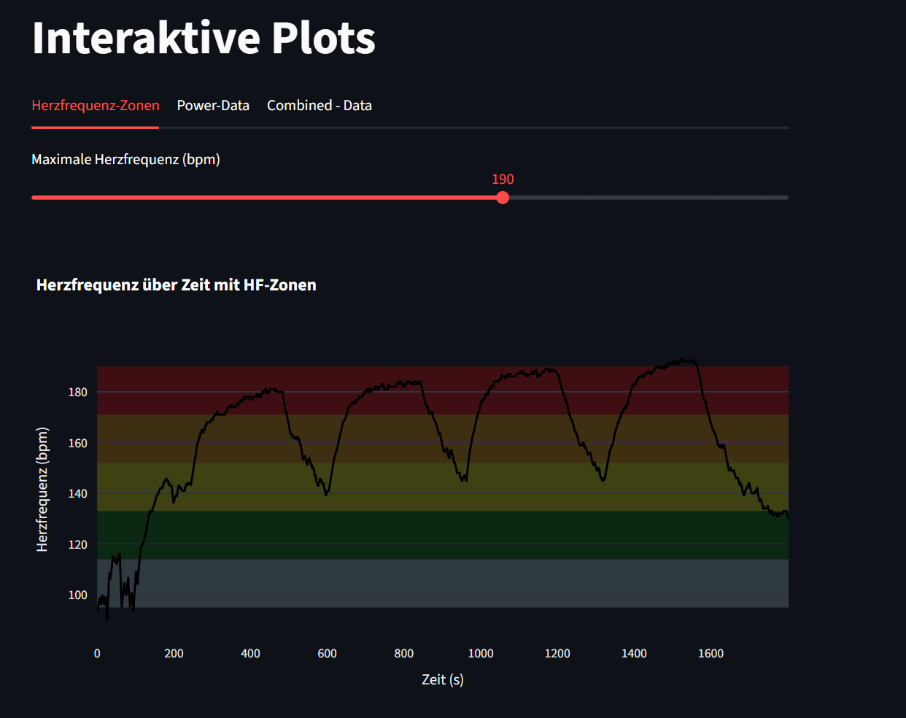
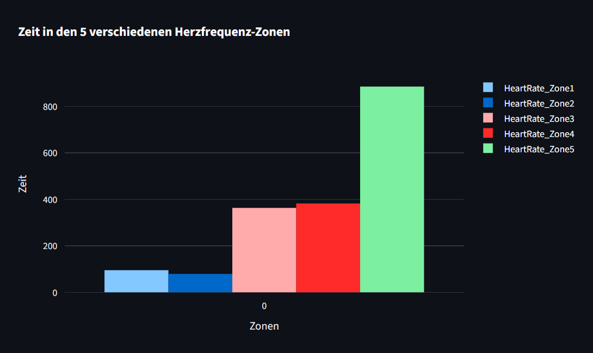
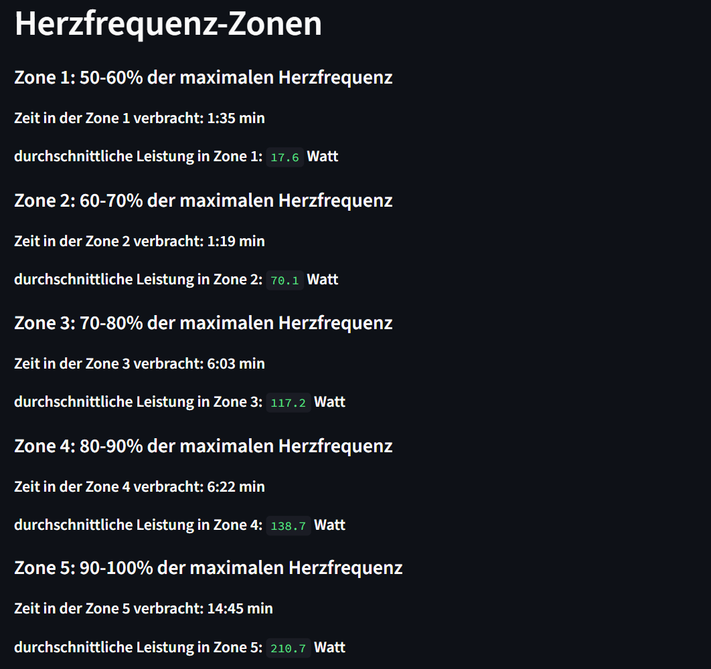
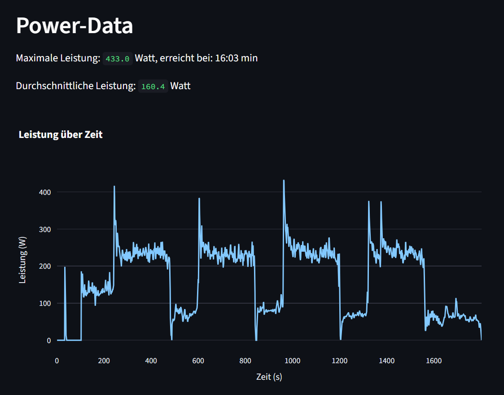
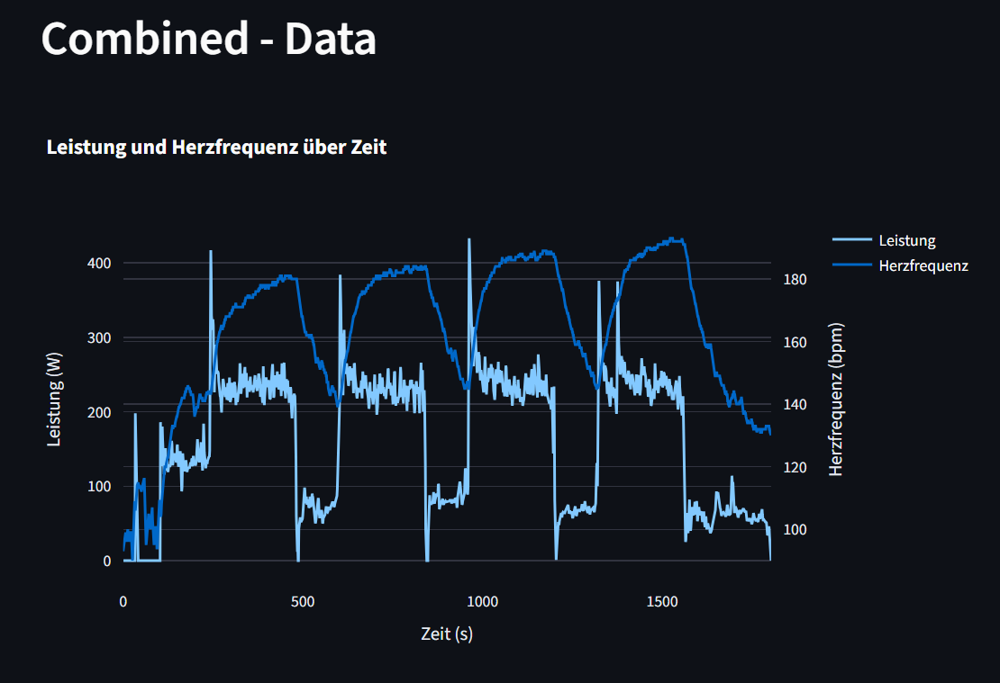

#Programminfo:

Das Programm ist die zweite Aufgabe für die Lehrveranstaltung Programmierübung durchgeführt von Auer Lukas und Gleinser Christoph.

#Vorgabe:

Aufgabe ist es die Datei activity.csv einzulesen und die Leistungswerte bzw. Herzfrequenzwerte über streamlit grafisch sowie als Zahlenwerte auszugeben. Um die Aufgabe umzusetzen, war wichtigen die gegeben Daten zu "reinigen" (leere Werte bzw. Werte mit 0 entfernen). Gefragt waren außerdem die Durchschnittswerte.

#Installationsanleitung:

Bevor das Programm verwendet werden kann, muss das Repository auf Ihr Gerät geklont ( Befehl: git clone https://github.com/gc0453/intact_plot.git) und mit PDM installiert werden ( Befehl: pdm install ). Das Programm kann anschließend mit dem folgenden Befehl ausgeführt werden: pdm run streamlit run main.py 

#Programmbeschreibung:
Slide 1: Herzfrequenzzonen

Slide 2:

Slide 3:
